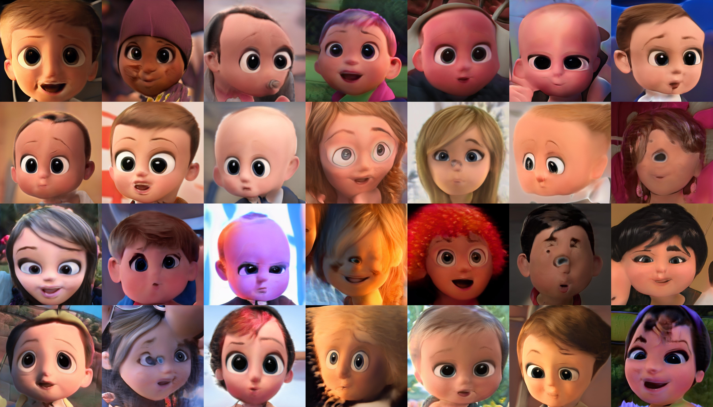
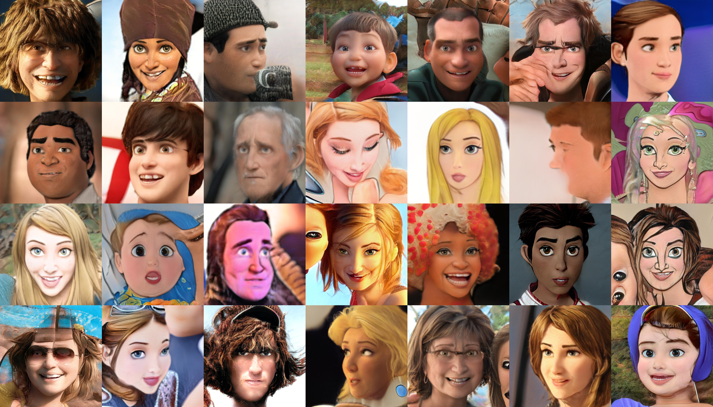
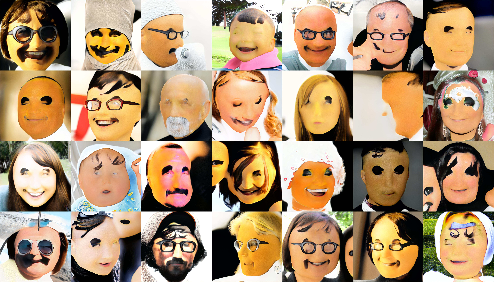

# 2020DA_CapstoneProject
경희대학교 2020학년도 2학기 데이터분석 캡스톤 디자인 프로젝트 파일을 공개하기 위한 Repo입니다.

# Research Aim
*  사람 얼굴을 Toonify하고, 사용자의 얼굴 영역을 찾아 표정 인식을 진행한다.
* Disney/Pixar/Dream Works의 캐릭터를 학습 시킨 StyleGAN2 모델을 이용해 사람 얼굴을 Toonify(캐릭터화)한다.
* FER2013 데이터 셋을 학습 시킨 Keras 기반 모델 mini-Xception 구조를 활용해 모델을 만들고, 영상에서 사람의 표정을 인식한다.

# Data Set
## 1. [Fer2013](https://www.kaggle.com/c/challenges-in-representation-learning-facial-expression-recognition-challenge/rules)
*  7가지 감정에 따른 사람 얼굴의 이미지 데이터 셋이다.
* mini-Xception 모델을 학습시킬 때 사용하였다.
* Emotion map = {0:Angry, 1:Disgust, 2:Fear, 3:Happy, 4:Sad, 5:Surprise, 6:Neutral}
  
## 2. [Flickr-Faces-HQ(FFHQ)](https://github.com/NVlabs/ffhq-dataset.git)

</img>

[그림 1. FFHQ를 base network로 설정했을 때의 fake init snapshot.]
*  NVlab의 StyleGAN2에서 제공하는 고화질의 사람 얼굴 데이터 셋으로, 직접 훈련을 시키진 않았지만 style을 씌우는 base network로 FFHQ 모델을 사용했다.
*  NVlab에서는 StyleGAN2 custom model 학습을 쉽게 할 수 있도록 FFHQ와 같은 데이터 셋과 pretrained 모델을 제공한다.
*  StyleGAN2에서 style을 학습시키기 이전, fake init 스냅샷으로 [그림 1]과 같은 사진이 생성된다.
  
## 3. [Emoji](https://drive.google.com/drive/folders/11xg3i-LVIWEIQ5mS1c97Lm3_iW5qoU10?usp=sharing)

</img>

[그림 2. Emoji-fy StyleGAN2 dataset.]
*  직접 Google의 이미지 검색에서 크롤링하고, resize와 RGB로의 변환 과정을 통해 생성한 emoji 데이터 셋이다.
*  Emoji-fy 모델을 학습할 때, 사용했다. [그림 2]와 같이 사람 얼굴 모델(FFHQ)의 특성이 많이 남아 있는 network를 저장하기 위해, 기존의 snapshot 주기를 default 값인 4에서 1로 줄여 주었다. 짧은 주기로 network를 저장하고, fake snapshot을 통해 원하는 모델을 선정했다.

## 4. [Baby Characters of Disney/Pixar/Dream Works](https://drive.google.com/drive/folders/1zL7ExFHUzD8y4ZIztb-kBpjoZj55uWrr?usp=sharing)

</img>

[그림 3] Baby-fy StyleGAN2 dataset
 
* Disney, Pixar, Dream Works의 애니메이션을 보며 직접 캡쳐한 데이터 셋이다. 애니메이션의 아기 캐릭터 얼굴을 resize, RGB 변환을 하여 사용했다.
* Baby-fy 모델을 학습시킬 때 활용했다. [그림 3]과 같이 사람 얼굴의 형태가 남아 있는 상태에서 애기메이션의 아기 얼굴에 나타나는 눈코입이 씌워져 있는 것을 확인할 수 있다.

## 5. [Characters of Disney/Pixar/Dream Works](https://github.com/justinpinkney/toonify)

</img>

[그림 4] Cartooni-fy StyleGAN2 dataset.

* Disney, Pixar, Dream Works의 애니메이션 캐릭터의 얼굴들로 이루어진 데이터 셋이다. Pinkney의 Toonify 프로젝트에서 쓰인 모델을 training할 때 사용된 데이터 셋이다.
* [링크](https://github.com/justinpinkney/toonify)로 이동하면 원본 데이터 셋을, [Pinkney의 블로그 포스트 글](https://www.justinpinkney.com/toonify-yourself/)에서 자세한 프로젝트의 내용을 확인할 수 있다.

# How to Create Dataset
## 1.  Crawling images from Google Search Engine.
*  구글에서 "emoji"를 검색해 나온 모든 이미지를 가져오는 코드이다. 추가적으로 이미지를 검토하며 선별하는 작업을 거쳐야 한다.
* Baby face dataset의 경우, 직접 YouTube 영상을 보며 하나하나 캡쳐해주었다. 캐릭터의 얼굴 영역에 집중해 크롤링하고, 크롭하고, 선별하는 작업보다는 직접 이미지를 모으는 것이 더 빠르다는 판단 하에 그렇게 진행하였다.
* Crawling 코드는 구글 드라이브로 공개해두었다. [링크](https://drive.google.com/drive/folders/16LaBxqRbWpAVHrQj2zo4R0nEh2C5k1zx?usp=sharing)를 통해 확인해주시길 바란다.

## 2.  Resize and Convert to RGB.
* 위에서 가져와 선별 작업을 마친 이미지들을 1024x1024 사이즈로 resize하고, RGBA 이미지들을 다시 RGB로 바꾸어주는 과정을 진행하는 코드이다.
* StyleGAN2의 데이터 셋(.tfrecord)으로 변환하기 위해서는 RGB 형태의 정사각형 이미지여야 한다. 따라서 만약 직접 custom 데이터 셋을 생성했다면 이 코드를 이용해 전처리를 진행해 주어야 한다.
* 자세한 코드의 내용은 구글 드라이브로 공개해두었다. [링크](https://drive.google.com/drive/folders/1cU2z_AbF4l7S_QegRMIkINQtxW0ZwEm_?usp=sharing)를 통해 확인해주시길 바란다.

*  Real-time Emotion Recognition\
</img>

*  How to create personal emoji
1. 왼쪽부터 StyleGAN2를 통해 생성한 Emojify 이미지 원본
2. cv2의 Contour 함수로 boundary 찾아서 mask를 씌운 결과물
3. mask 부분을 투명하게 제거하고 png 파일로 저장한 결과물
4. 얼굴 중심으로 crop한 결과물

|  </img>  |  </img>  |  </img>  |  </img>  |
|:---:|:---:|:---:|:---:|

## Training Results
*  Baby-fy Results\
</img>

*  Tooni-fy Results\
</img>

*  Emoji-fy Results\
</img>
