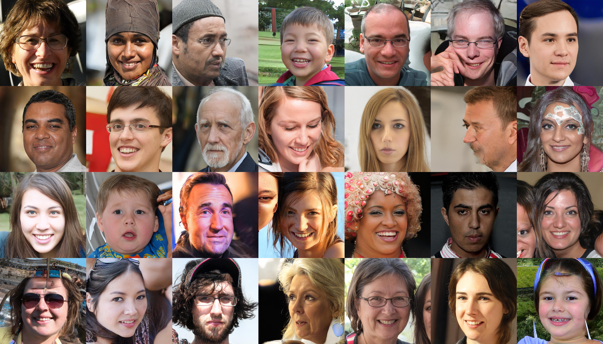
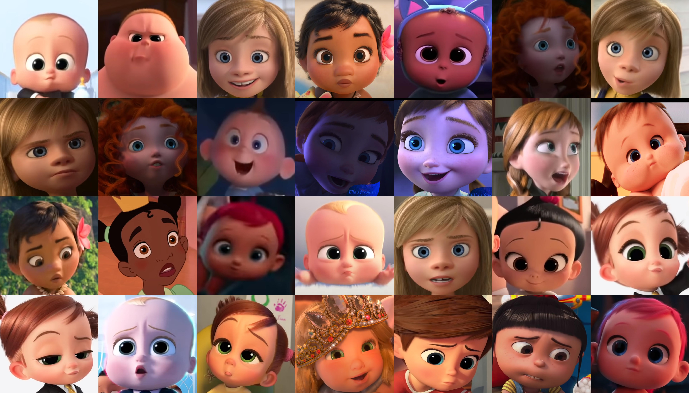
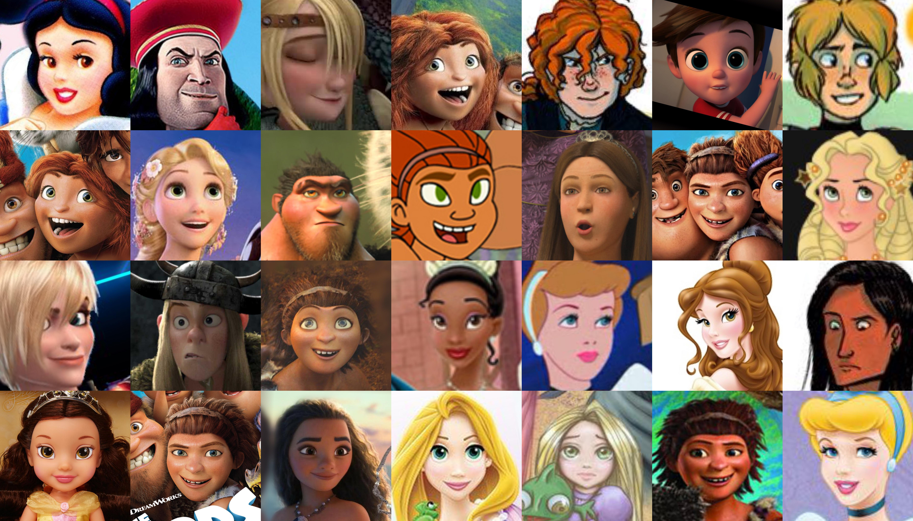
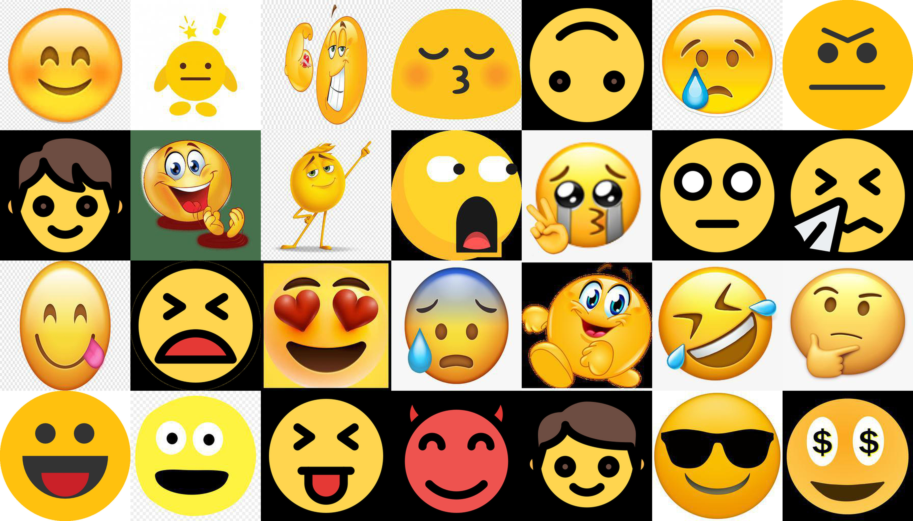

# 2020DA_CapstoneProject

2020학년도 2학기 데이터분석 캡스톤 디자인 프로젝트 파일을 공개하기 위한 Repo입니다.

Google Drive : https://drive.google.com/drive/folders/1coYOcNSM0Zt3LNgoP1daZi7UAqkOWBvz?usp=sharing

</img>

## DataSet
*  FFHQ(pretained network) : base network로 사용.\
</img>

*  Face of baby characters in Disney/Pixar\
</img>

*  Face of characters in Disney/Pixar\
</img>

* Emoji\
</img>

## Training Results
*  Baby-fy Results\
</img>

*  Tooni-fy Results\
</img>

*  Emoji-fy Results\
</img>
