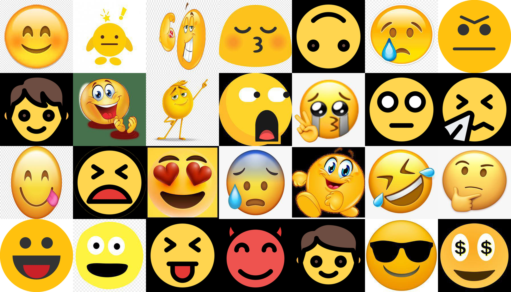
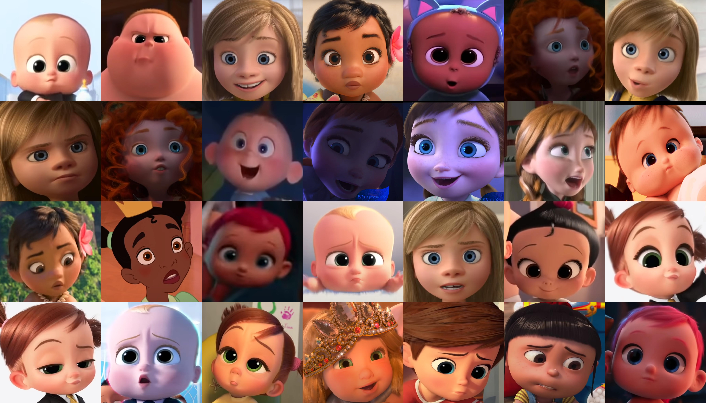

# 2020DA_CapstoneProject
경희대학교 2020학년도 2학기 데이터분석 캡스톤 디자인 프로젝트 파일을 공개하기 위한 Repo입니다.

# Research Aim
*  사람 얼굴을 Toonify하고, 사용자의 얼굴 영역을 찾아 표정 인식을 진행한다.
* Disney/Pixar/Dream Works의 캐릭터를 학습 시킨 StyleGAN2 모델을 이용해 사람 얼굴을 Toonify(캐릭터화)한다.
* FER2013 데이터 셋을 학습 시킨 Keras 기반 모델 mini-Xception 구조를 활용해 모델을 만들고, 영상에서 사람의 표정을 인식한다.

# Data Set
### 1. [Fer2013](https://www.kaggle.com/c/challenges-in-representation-learning-facial-expression-recognition-challenge/rules)
*  7가지 감정에 따른 사람 얼굴의 이미지 데이터 셋이다.
* mini-Xception 모델을 학습시킬 때 사용하였다.
* Emotion map = {0:Angry, 1:Disgust, 2:Fear, 3:Happy, 4:Sad, 5:Surprise, 6:Neutral}
  
### 2. [Flickr-Faces-HQ(FFHQ)](https://github.com/NVlabs/ffhq-dataset.git)

</img>

[그림 1. FFHQ를 base network로 설정했을 때의 fake init snapshot.]
*  NVlab의 StyleGAN2에서 제공하는 고화질의 사람 얼굴 데이터 셋으로, 직접 훈련을 시키진 않았지만 style을 씌우는 base network로 FFHQ 모델을 사용했다.
*  NVlab에서는 StyleGAN2 custom model 학습을 쉽게 할 수 있도록 FFHQ와 같은 데이터 셋과 pretrained 모델을 제공한다.
*  StyleGAN2에서 style을 학습시키기 이전, fake init 스냅샷으로 [그림 1]과 같은 사진이 생성된다.
  
### 3. [Emoji](https://drive.google.com/drive/folders/11xg3i-LVIWEIQ5mS1c97Lm3_iW5qoU10?usp=sharing)

</img>

[그림 2. Emoji-fy StyleGAN2 dataset.]
*  직접 Google의 이미지 검색에서 크롤링하고, resize와 RGB로의 변환 과정을 통해 생성한 emoji 데이터 셋이다.
*  Emoji-fy 모델을 학습할 때, 사용했다. [그림 2]와 같이 사람 얼굴 모델(FFHQ)의 특성이 많이 남아 있는 network를 저장하기 위해, 기존의 snapshot 주기를 default 값인 4에서 1로 줄여 주었다. 짧은 주기로 network를 저장하고, fake snapshot을 통해 원하는 모델을 선정했다.

### 4. [Baby Characters of Disney/Pixar/Dream Works](https://drive.google.com/drive/folders/1zL7ExFHUzD8y4ZIztb-kBpjoZj55uWrr?usp=sharing)

</img>

[그림 3] Baby-fy StyleGAN2 dataset
 
* Disney, Pixar, Dream Works의 애니메이션을 보며 직접 캡쳐한 데이터 셋이다. 애니메이션의 아기 캐릭터 얼굴을 resize, RGB 변환을 하여 사용했다.
* Baby-fy 모델을 학습시킬 때 활용했다. [그림 3]과 같이 사람 얼굴의 형태가 남아 있는 상태에서 애기메이션의 아기 얼굴에 나타나는 눈코입이 씌워져 있는 것을 확인할 수 있다.

### 5. [Characters of Disney/Pixar/Dream Works](https://github.com/justinpinkney/toonify)

</img>

[그림 4] Cartooni-fy StyleGAN2 dataset.

* Disney, Pixar, Dream Works의 애니메이션 캐릭터의 얼굴들로 이루어진 데이터 셋이다. Pinkney의 Toonify 프로젝트에서 쓰인 모델을 training할 때 사용된 데이터 셋이다.
* [링크](https://github.com/justinpinkney/toonify)로 이동하면 원본 데이터 셋을, [Pinkney의 블로그 포스트 글](https://www.justinpinkney.com/toonify-yourself/)에서 자세한 프로젝트의 내용을 확인할 수 있다.

# How to Create Dataset
### 1.  Crawling images from Google Search Engine.
*  구글에서 "emoji"를 검색해 나온 모든 이미지를 가져오는 코드이다. 추가적으로 이미지를 검토하며 선별하는 작업을 거쳐야 한다.
* Baby face dataset의 경우, 직접 YouTube 영상을 보며 하나하나 캡쳐해주었다. 캐릭터의 얼굴 영역에 집중해 크롤링하고, 크롭하고, 선별하는 작업보다는 직접 이미지를 모으는 것이 더 빠르다는 판단 하에 그렇게 진행하였다.
* Crawling 코드는 구글 드라이브로 공개해두었다. [링크](https://drive.google.com/drive/folders/16LaBxqRbWpAVHrQj2zo4R0nEh2C5k1zx?usp=sharing)를 통해 확인해주시길 바란다.

### 2.  Resize and Convert to RGB.
* 위에서 가져와 선별 작업을 마친 이미지들을 1024x1024 사이즈로 resize하고, RGBA 이미지들을 다시 RGB로 바꾸어주는 과정을 진행하는 코드이다.
* StyleGAN2의 데이터 셋(.tfrecord)으로 변환하기 위해서는 RGB 형태의 정사각형 이미지여야 한다. 따라서 만약 직접 custom 데이터 셋을 생성했다면 이 코드를 이용해 전처리를 진행해 주어야 한다.
* 자세한 코드의 내용은 구글 드라이브로 공개해두었다. [링크](https://drive.google.com/drive/folders/1cU2z_AbF4l7S_QegRMIkINQtxW0ZwEm_?usp=sharing)를 통해 확인해주시길 바란다.

# Initial Design
</img>

[그림 5] 초기 프로그램 설계도
 - 초기 프로그램 구조는 [그림 5]와 같다. StyleGAN2 모델을 이용하여 만든 personal emoji를 실시간 영상에서 얼굴 영역에 렌더링한다. 이때, 각각의 표정에 맞는 emoji를 미리 만들어두고, 예측한 표정에 따라 렌더링하는 것을 목표로 설계 및 구현했다.

### 1. Create Personal Emoji
|  </img>  |  </img>  |  </img>  |  </img>  |
|:---:|:---:|:---:|:---:|

[그림 6] personal emoji 생성 과정. 왼쪽부터 StyleGAN2를 통해 생성한 personal emoji 원본, mask를 씌운 이미지, mask 부분을 투명하게 제거한 이미지, face crop을 한 최종 이미지.

- Personal emoji는 사람의 얼굴을 토대로 emoji의 스타일을 덧씌워 새로운 emoji를 생성한 것을 의미한다. [그림 6]을 보면 가장 왼쪽의 이미지가 사람의 얼굴 사진을 base로 생성한 personal emoji이다. Emoji-fy 모델을 이용하여 생성한 사진에서 배경을 제거해주기 위해 cv2의 Contour 함수를 사용했다.
- Contour 영역을 검출하고, 배경으로 추정되는 부분에 mask를 씌운다. 이 mask 부분의 색상을 지워주고, RGBA로 변환하여 png 파일로 저장한다. 이 png 파일을 얼굴 영역 중심으로 crop 해주면 최종 이미지인 가장 오른쪽의 이미지가 생성된다.

### 2. Real-time Emotion Recognition and Rendering Personal Emoji
</img>

[그림 7] 실시간 personal emoji 렌더링 예시

- mini-Xception 구조의 경우, 파라미터의 수가 기존 모델에 비해 현저히 적어 실시간 영상에서 사용하는 것이 문제가 없었다. 그러나 StyleGAN2의 경우, GPU 메모리 부족과 용량이 매우 커 projection을 하는 시간이 매우 오래 걸리는 점을 고려하여 [그림 7]과 같이 미리 생성한 personal emoji를 렌더링하도록 구현했다.
- mini-Xception 모델은 [omar178](https://github.com/omar178/Emotion-recognition#p1)과 [oarriaga](https://github.com/oarriaga/face_classification)의 작업물과 논문을 참고하여 scaling 하였다.

# Final Design
</img>

[그림 8] 최종 프로그램 설계도
- Real-time을 포기하고, 영상의 프레임 단위로 Tooni-fy를 진행하는 것을 선택했다. [그림 8]과 같이 원본 영상이 들어오면, 10 프레임 단위로 프레임을 받아 와 Toonified 영상을 만든다. 그렇게 만들어진 Toonified 영상에 Emotion Recognition을 진행해 최종 결과물을 만든다.
- 초기 설계에서 Personal emoji의 결과물이 예상보다 예쁘게 나오지 않아 Disney/Pixar/Dream Works의 애니메이션 캐릭터 얼굴을 학습 시킨 Toonify 모델을 사용했다.

# Results
### 1. Real-time Emotion Recognition
| Model | Batch Size | Resolution | Augmentation | # of Conv Blocks | Architecture | Val Acc | Val Loss |
|--|--|--|--|--|--|--|--|
| origin | 32 | 48x48 | X | 4 | mini | 0.6478 | 0.9646 |
| 1 | 32 | 48x48 | O(1,000) | 4 | mini  | 0.6418 | 1.0114 |
| 2 | 32 | 48x48 | O(5,000) | 4 | mini  | 0.6363 | 0.9962 |
| 3 | 48 | 48x48 | O(5,000) | 4 | mini  | 0.6381 | 0.9445 |
| 4 | 32 | 48x48 | O(10,000) | 4 | mini  | 0.6441 | 0.9836 |
| 5 | 32 | 48x48 | O(10,000) | 4 | mini  | 0.6450 | 0.9814 |
| 6 | 48 | 128x128 | O(10,000) | 5 | mini  | 0.6743 | 0.9449 |
| 7 | 32 | 128x128 | O(10,000) | 5 | mini  | 0.6734 | 0.9678 |
| 8 | 48 | 96x96 | O(10,000) | 6 | mini  | 0.6778 | 0.9307 |
| **9** | 32 | 96x96 | O(10,000) | 6 | mini  | **0.6817** | **0.9269** |
| 10 | 32 | 72x72 | O(10,000) | 6 | mini | 0.6539 | 0.9622 |
| 11 | 32 | 48x48 | O(10,000) | 4 | Big | 0.6482 | 0.9949 |
| 12 | 32 | 94x94 | O(10,000) | 4 | Big | 0.6454 | 1.0088 |
| 13 | 32 | 128x128 | O(10,000) | 4 | Big | 0.6300 | 1.0584 |
| 14 | 32 | 96x96 | O(10,000) | 4 | origin | 0.6704 | 0.9361 |
| 15 | 32 | 96x96 | O(10,000) | 4 | origin | 0.6705 | 0.9304 |
| 16 | 32 | 96x96 | O(10,000) | 4 | origin | 0.6626 | 0.9816 |

[도표 1] Emotion Recognition Model Scaling 과정

*  mini : mini-Xception, Big : Big-Xception, origin : Xception
*  Big-Xception과 origin-Xception의 경우, 모델의 용량 대비 정확도가 mini-Xception보다 떨어져 추가적으로 scaling하지 않았다.
*  Real-time에서 돌아가는 것을 초기 목표로 했기에 validation set에 대한 정확도가 original model보다 **4%** 오른 **model 9**를 최종 모델로 선정했다.

</img>
</img>
</img>
