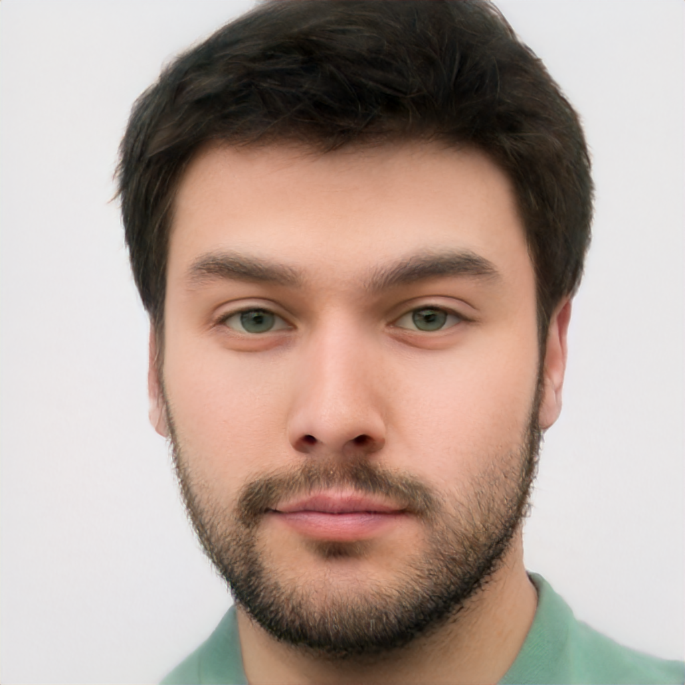

# 2020 Data Analysis Capstone Design
경희대학교 2020학년도 2학기 데이터분석 캡스톤 디자인 프로젝트의 소스코드와 실험 내용을 공개하기 위한 Repository 입니다.

# Quick Summary
- mp4 영상에서 사람의 얼굴 영역을 찾아 Tooni-fy하고, 해당 얼굴 영역에서 표정을 인식한 결과를 표시한 영상을 최종 결과물로 제시한다.
- Tooni-fy는 StyleGAN2 모델을 이용하고, Emotion Recognition은 mini-Xception 모델을 이용한다. StyleGAN2는 custom dataset을 이용하여 훈련시켰고, mini-Xception은 FER2013 dataset을 이용해 훈련시켰다. Dataset과 관련한 내용은 [2. Dataset](#dataset_head)에서 확인 가능하다.
- StyleGAN2는 TensorFlow(TF) 1.x를 지원하고, mini-Xception은 TF 2.x를 지원하기 때문에 동시에 사용하는 것이 불가능하다. Colab에서 TF 1.x를 지정하여 Toonify(StyleGAN2)를 먼저 진행하고, Tooni-fy된 영상에서 TF 2.x를 지정해 Emotion Recognition을 진행하였다.
- 이론적인 부분(StyleGAN2, mini-Xception의 구조와 이론)은 현재 repository에 올려둔 **Interim report.pdf**에서 확인 가능하다. StyleGAN2 version 1, 2를 발표한 논문과 mini-Xception 구조를 처음 제안하고 사용한 논문에 대한 리뷰를 작성해두었다.

# 1. Research Aim
- 사람의 얼굴 영역을 tooni-fy하고, 사용자의 얼굴 영역에서 표정 인식을 진행한다.
- Disney/Pixar/Dream Works 등의 애니메이션 캐릭터를 학습 시킨 StyleGAN2 모델을 이용하여 사람의 얼굴을 Tooni-fy(캐릭터화)한다. 이때 사용한 dataset은 [2. Dataset](#dataset_head)에서, 모델의 network snapshot은 [5.4 StyleGAN2](#stylegan_result)에서 확인 가능하다.
- 사람의 표정 이미지를 7개의 카테고리로 나누어 제공하는 FER2013을 이용하여 학습 시킨 Keras 기반 모델 mini-Xception을 scaling하고, 영상에서 사람의 표정을 인식해 결과를 표시한다. 이때 사용한 dataset은 [2. Dataset](#dataset_head)에서, 모델의 scaling 과정은 [5.3 mini-Xception](#mini_xception)에서 확인 가능하다.

# <a id="dataset_head">2. Dataset
## 2.1 How to Create Dataset
**1. Crawling images from Google Search Engine.**
*  구글에서 "emoji"를 검색해 나온 모든 이미지를 가져오는 코드이다. 추가적으로 이미지를 검토하며 선별하는 작업을 거쳐야 한다.
* Baby face dataset의 경우, 직접 YouTube 영상을 보며 하나하나 캡쳐해주었다. 캐릭터의 얼굴 영역에 집중해 크롤링하고, 크롭하고, 선별하는 작업보다는 직접 이미지를 모으는 것이 더 빠르다는 판단 하에 그렇게 진행하였다.
* Crawling 코드는 구글 드라이브로 공개해두었다. [링크](https://drive.google.com/drive/folders/16LaBxqRbWpAVHrQj2zo4R0nEh2C5k1zx?usp=sharing)를 통해 확인해주시길 바란다.

**2. Resize and Convert to RGB.**
* 위에서 가져와 선별 작업을 마친 이미지들을 1024x1024 사이즈로 resize하고, RGBA 이미지들을 다시 RGB로 바꾸어주는 과정을 진행하는 코드이다.
* StyleGAN2의 데이터 셋(.tfrecord)으로 변환하기 위해서는 RGB 형태의 정사각형 이미지여야 한다. 따라서 만약 직접 custom 데이터 셋을 생성했다면 이 코드를 이용해 전처리를 진행해 주어야 한다.
* 자세한 코드의 내용은 구글 드라이브로 공개해두었다. [링크](https://drive.google.com/drive/folders/1cU2z_AbF4l7S_QegRMIkINQtxW0ZwEm_?usp=sharing)를 통해 확인해주시길 바란다.

## 2.2 Used Dataset
**1. [Fer2013](https://www.kaggle.com/c/challenges-in-representation-learning-facial-expression-recognition-challenge/rules)**
*  7가지 감정에 따른 사람 얼굴의 이미지 데이터 셋이다. mini-Xception 모델을 학습시킬 때 사용하였다.
* Emotion map = {0:Angry, 1:Disgust, 2:Fear, 3:Happy, 4:Sad, 5:Surprise, 6:Neutral}

**2. [Flickr-Faces-HQ(FFHQ)](https://github.com/NVlabs/ffhq-dataset.git)**

</img>

[그림 1] FFHQ를 base network로 설정했을 때의 fake init snapshot.  출처 : [NVlab StyleGAN2 repository](https://github.com/NVlabs/ffhq-dataset.git)

*  NVlab의 StyleGAN2에서 제공하는 고화질의 사람 얼굴 데이터 셋으로, 직접 훈련을 시키진 않았지만 style을 씌우는 base network로 FFHQ 모델을 사용했다.
*  NVlab에서는 StyleGAN2 custom model 학습을 쉽게 할 수 있도록 FFHQ와 같은 데이터 셋과 pretrained 모델을 제공한다.
*  StyleGAN2에서 style을 학습시키기 이전, fake init 스냅샷으로 [그림 1]과 같은 사진이 생성된다.

**3. [Emoji](https://drive.google.com/drive/folders/11xg3i-LVIWEIQ5mS1c97Lm3_iW5qoU10?usp=sharing)**
*  직접 Google의 이미지 검색에서 크롤링하고, resize와 RGB로의 변환 과정을 통해 생성한 emoji 데이터 셋이다.
*  Emoji-fy 모델을 학습할 때, 사용했다. [그림 2]와 같이 사람 얼굴 모델(FFHQ)의 특성이 많이 남아 있는 network를 저장하기 위해, 기존의 snapshot 주기를 default 값인 4에서 1로 줄여 주었다. 짧은 주기로 network를 저장하고, fake snapshot을 통해 원하는 모델을 선정했다.

**4. [Baby Characters of Disney/Pixar/Dream Works](https://drive.google.com/drive/folders/1zL7ExFHUzD8y4ZIztb-kBpjoZj55uWrr?usp=sharing)**
* Disney, Pixar, Dream Works의 애니메이션을 보며 직접 캡쳐한 데이터 셋이다. 애니메이션의 아기 캐릭터 얼굴을 resize, RGB 변환을 하여 사용했다.
* Baby-fy 모델을 학습시킬 때 활용했다. [그림 3]과 같이 사람 얼굴의 형태가 남아 있는 상태에서 애기메이션의 아기 얼굴에 나타나는 눈코입이 씌워져 있는 것을 확인할 수 있다.

**5. [Characters of Disney/Pixar/Dream Works](https://github.com/justinpinkney/toonify)**

</img>

[그림 4] Cartooni-fy StyleGAN2 dataset. 출처 : [Justin Pinkney의 Cartoon Dataset ](https://github.com/justinpinkney/toonify)

* Disney, Pixar, Dream Works의 애니메이션 캐릭터의 얼굴들로 이루어진 데이터 셋이다. Pinkney의 Toonify 프로젝트에서 쓰인 모델을 training할 때 사용된 데이터 셋이다.
* [링크](https://github.com/justinpinkney/toonify)로 이동하면 원본 데이터 셋을, [Pinkney의 블로그 포스트 글](https://www.justinpinkney.com/toonify-yourself/)에서 자세한 프로젝트의 내용을 확인할 수 있다.

# 3. Design
## 3.1 Initial Design
</img>
[그림 5] 초기 프로그램 설계도
 - 초기 프로그램 구조는 [그림 5]와 같다. StyleGAN2 모델을 이용하여 만든 personal emoji를 실시간 영상에서 얼굴 영역에 렌더링한다. 이때, 각각의 표정에 맞는 emoji를 미리 만들어두고, 예측한 표정에 따라 렌더링하는 것을 목표로 설계 및 구현했다.

## 3.2 Final Design
</img>

[그림 8] 최종 프로그램 설계도
- Real-time을 포기하고, 영상의 프레임 단위로 Tooni-fy를 진행하는 것을 선택했다. [그림 8]과 같이 원본 영상이 들어오면, 10 프레임 단위로 프레임을 받아 와 Toonified 영상을 만든다. 그렇게 만들어진 Toonified 영상에 Emotion Recognition을 진행해 최종 결과물을 만든다.
- 초기 설계에서 Personal emoji의 결과물이 예상보다 예쁘게 나오지 않아 Disney/Pixar/Dream Works의 애니메이션 캐릭터 얼굴을 학습 시킨 Toonify 모델을 사용했다.

# <a id="train_model">4. How to Train
## 4.1 StyleGAN2 Using Custom Dataset

</img>

## 4.2 Scaling mini-Xception

</img>

# 5. Results
## <a id="personal_emoji">5.1 Create a Personal Emoji
|  </img>  |  </img>  |  </img>  |  </img>  |
|:---:|:---:|:---:|:---:|

[그림 6] personal emoji 생성 과정. 왼쪽부터 StyleGAN2를 통해 생성한 personal emoji 원본, mask를 씌운 이미지, mask 부분을 투명하게 제거한 이미지, face crop을 한 최종 이미지.

- Personal emoji는 사람의 얼굴을 토대로 emoji의 스타일을 덧씌워 새로운 emoji를 생성한 것을 의미한다. [그림 6]을 보면 가장 왼쪽의 이미지가 사람의 얼굴 사진을 base로 생성한 personal emoji이다. Emoji-fy 모델을 이용하여 생성한 사진에서 배경을 제거해주기 위해 cv2의 Contour 함수를 사용했다.
- Contour 영역을 검출하고, 배경으로 추정되는 부분에 mask를 씌운다. 이 mask 부분의 색상을 지워주고, RGBA로 변환하여 png 파일로 저장한다. 이 png 파일을 얼굴 영역 중심으로 crop 해주면 최종 이미지인 가장 오른쪽의 이미지가 생성된다. 자세한 코드는 **Personal-Emoji** 폴더에서 확인할 수 있다.

## <a id="real_time">5.2 Real-time Emotion Recognition & Rendering a Personal Emoji
</img>

[그림 7] 실시간 personal emoji 렌더링 예시

- mini-Xception 구조의 경우, 파라미터의 수가 기존 모델에 비해 현저히 적어 실시간 영상에서 사용하는 것이 문제가 없었다. 그러나 StyleGAN2의 경우, GPU 메모리 부족과 용량이 매우 커 projection을 하는 시간이 매우 오래 걸리는 점을 고려하여 [그림 7]과 같이 미리 생성한 personal emoji를 렌더링하도록 구현했다.
- mini-Xception 모델은 [omar178](https://github.com/omar178/Emotion-recognition#p1)과 [oarriaga](https://github.com/oarriaga/face_classification)의 작업물과 논문을 참고하여 scaling 하였다.

## <a id="mini_xception">5.3 mini-Xception
| Model | Batch Size | Resolution | Augmentation | # of Conv Blocks | Architecture | Val Acc | Val Loss |
|--|--|--|--|--|--|--|--|
| origin | 32 | 48x48 | X | 4 | mini | 0.6478 | 0.9646 |
| 1 | 32 | 48x48 | O(1,000) | 4 | mini  | 0.6418 | 1.0114 |
| 2 | 32 | 48x48 | O(5,000) | 4 | mini  | 0.6363 | 0.9962 |
| 3 | 48 | 48x48 | O(5,000) | 4 | mini  | 0.6381 | 0.9445 |
| 4 | 32 | 48x48 | O(10,000) | 4 | mini  | 0.6441 | 0.9836 |
| 5 | 32 | 48x48 | O(10,000) | 4 | mini  | 0.6450 | 0.9814 |
| 6 | 48 | 128x128 | O(10,000) | 5 | mini  | 0.6743 | 0.9449 |
| 7 | 32 | 128x128 | O(10,000) | 5 | mini  | 0.6734 | 0.9678 |
| 8 | 48 | 96x96 | O(10,000) | 6 | mini  | 0.6778 | 0.9307 |
| **9** | 32 | 96x96 | O(10,000) | 6 | mini  | **0.6817** | **0.9269** |
| 10 | 32 | 72x72 | O(10,000) | 6 | mini | 0.6539 | 0.9622 |
| 11 | 32 | 48x48 | O(10,000) | 4 | Big | 0.6482 | 0.9949 |
| 12 | 32 | 94x94 | O(10,000) | 4 | Big | 0.6454 | 1.0088 |
| 13 | 32 | 128x128 | O(10,000) | 4 | Big | 0.6300 | 1.0584 |
| 14 | 32 | 96x96 | O(10,000) | 4 | origin | 0.6704 | 0.9361 |
| 15 | 32 | 96x96 | O(10,000) | 4 | origin | 0.6705 | 0.9304 |
| 16 | 32 | 96x96 | O(10,000) | 4 | origin | 0.6626 | 0.9816 |

[도표 1] Emotion Recognition Model Scaling 과정

*  mini : mini-Xception, Big : Big-Xception, origin : Xception
*  Big-Xception과 origin-Xception의 경우, 모델의 용량 대비 정확도가 mini-Xception보다 떨어져 추가적으로 scaling하지 않았다.
*  Real-time에서 돌아가는 것을 초기 목표로 했기에 validation set에 대한 정확도가 original model보다 **4%** 오른 **model 9**를 최종 모델로 선정했다.
*  Training과 Real-time Emotion Recognition 관련 코드는 **Emotion-Recognition** 폴더에서 확인할 수 있다.

## <a id="stylegan_result">5.4 StyleGAN2
### 5.4.1 Network Snapshots
</img>

[그림 9] Emoji-fy 모델의 network snapshot

</img>

[그림 10] Baby-fy 모델의 network snapshot

</img>

[그림 11] Tooni-fy 모델의 network snapshot

- Emoji, Baby characters, Characters 데이터 셋을 FFHQ을 base로 학습시킨 StyleGAN2 모델의 network snapshot이다. Network를 저장하는 간격을 default 값인 4에서 1로 줄여 스타일이 조금씩 입혀지는 과정들을 보고, 가장 결과물이 나은 모델을 선정했다.
- 결과물에서 사용한 Toonify 모델은 [그림 11]이다. FFHQ 데이터 셋[그림 1]과 비교하면 원본에서 얼마나 변했는지를 확인할 수 있다. Training 코드는 **StyleGAN2_Cartoon_Model.ipynb**에서 확인할 수 있다.
- Emoji-fy model의 결과물은 [여기](https://drive.google.com/drive/folders/17OWhipBasJBeDOBvuXLDtq5qn6Ok_vZ_?usp=sharing)에서, Baby-fy model의 결과물은 [여기](https://drive.google.com/drive/folders/15RFw0e-gFsgPx2SihYMeFz4FvBVFOLDk?usp=sharing)에서, Tooni-fy model의 결과물은 [여기](https://drive.google.com/drive/folders/17a6M7VyKebakW_bcdSZ0mjl1B1w9kqOV?usp=sharing)에서 확인 가능하다.

### 5.4.2 Compare Snapshots
| </img>  |  </img>  |  </img>  |  </img>  |
|:--:|:--:|:--:|:--:|

[그림 12] 왼쪽부터 FFHQ, Emoji-fy, Baby-fy, Tooni-fy 모델의 snapshot.

- Snapshot 속 한 인물을 중심으로 비교해볼 수 있다. Projection 결과물이 가장 일정하고, 이쁘게 나오는 Tooni-fy 모델을 최종 모델로 선정했다.

### 5.4.3 Sample Images of Projection
| </img>  |  </img>  |  </img>  |
|:--:|:--:|:--:|

[그림 13] 왼쪽부터 원본 이미지, 얼굴 중심으로 align된 이미지, Tooni-fied 이미지.

- 왼쪽의 원본 이미지는 100K Faces 프로젝트를 통해 생성된 가상의 인물 사진이다. 인터넷 상에서 무료로 공개되어 있으므로 [구글 드라이브 링크](https://drive.google.com/drive/folders/1WPsVkdt4qDxjV2itBgw_DXkTdU-esEwY)에서 사진들을 확인 가능하다.
- Projection은 StyleGAN2의 FFHQ 얼굴 탐지와 정렬 모듈을 사용한다. Projection 코드는 [pinkney의 Toonify Yourself](https://colab.research.google.com/drive/1s2XPNMwf6HDhrJ1FMwlW1jl-eQ2-_tlk?usp=sharing)를 참고했다.

## <a id="frame_by_frame">5.5 Frame-by-frame Toonify & Emotion Recognition 

</img>
</img>

[그림 14] Sample 1(왼쪽)과 Sample 2(오른쪽)의 Tooni-fied Video 

</img>
</img>

[그림 15] Sample 1(왼쪽)과 Sample 2(오른쪽)의 최종 결과물

### 5.5.1 How to Create Sample Video
1. 1080p 이상의 화질(FHD 이상, 30fps)로 얼굴 동영상을 촬영한다.
2. 촬영한 원본 영상을 10 프레임에 1장씩 프레임을 받아와 저장한다.
3. 저장한 이미지를 StyleGAN2 FFHQ 모듈을 활용해 얼굴 영역만 crop하고, align한다.
4. Aligned 이미지를 Tooni-fy 모델에 projection한다.
5. Projection 이미지들을 모아서 cv2의 VideoWriter로 mp4 영상(fps=3)을 생성한다.
6. [그림 14]와 [그림 16]의 영상이 생성된다.

### 5.5.2 How to Create Final Output
1. [그림 14]와 [그림 16] 영상을 가져온다.
2. 영상에서 Emotion Recognition을 실시한다. 이때, 얼굴이 검출되지 않으면 Cannot detect face region 이라는 문구를 삽입한다.
3. Emotion Recognition을 모든 프레임에 실시하고 검출된 표정 정보를 삽입한 프레임을 다시 저장한다.
4. 이 프레임을 VideoWriter로 mp4 영상(fps=3)을 생성한다.
5. [그림 15]와 [그림 17]은 이렇게 생성된 최종 영상을 0.5배속한 것이다. 영상이 끊겨 보이는 것을 최소화 하기 위해 fps를 3으로 생성했으나, 표정 인식 결과물을 천천히 확인 가능하도록 느린 버전의 gif 파일을 추가했다.

모든 프레임(원본, tooni-fied, emotion-recognition)은 이미지로 저장하고, 영상으로도 저장했다. 각각의 이미지에 따른 프로세스가 잘 이루어졌는지, 세부적인 결과물을 확인하기 위해 그렇게 구현하였다. 자세한 코드의 내용은 **Frame_by_frame_Emotion_Classification_and_Emojify.ipynb**에서 확인 가능하다.

# 6. Reference
This project was inspired by these amazing projects below. If you want to see the original project of StyleGAN2, Toonify, and Emotion Recognition using mini-Xception, please visit the address below.

### 6.1 StyleGAN2 & Toonify
1. [NVlab의 original StyleGAN2 Repo.](https://github.com/NVlabs/stylegan2.git)
2. [Pinkney의 StyleGAN2 fork.](https://github.com/justinpinkney/stylegan2.git)
3. [dvschultz의 StyleGAN2 fork.](https://github.com/dvschultz/stylegan2)
4. [Pinkney의 Toonify Yourself!](https://www.justinpinkney.com/toonify-yourself/)

### 6.2 mini-Xception
5. [Oarriaga의 mini-Xception Repo.](https://github.com/oarriaga/face_classification.git)
6. [omar178의 mini-Xception 응용 Repo.](https://github.com/omar178/Emotion-recognition.git)
